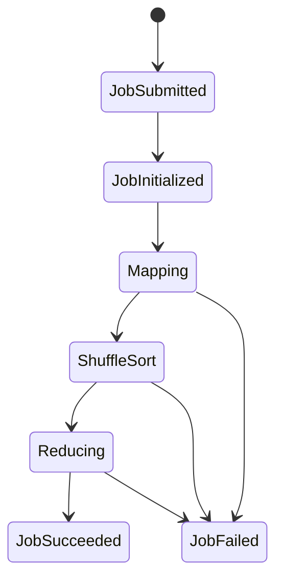

# Domain Model: Hadoop / MapReduce Simulator

This document formalizes the didactic domain model for a deterministic, step-based MapReduce simulator. It focuses on conceptual correctness and observability over performance or Hadoop internals.

## Core Domain Entities
- Job: A MapReduce workload with inputs, configuration, and lifecycle state.
- InputDataset: Logical input split into InputSplits for mapping.
- InputSplit: A chunk of input assigned to a MapTask; contains Records.
- Record: Atomic input unit (key/value) consumed by map.
- MapTask: Processes one InputSplit; emits intermediate key/value pairs.
- ReduceTask: Consumes partitions of intermediate data; emits output records.
- Partition: A deterministic mapping of keys to reducer indices.
- Shuffle: Logical transfer of map outputs to reducers; includes sort/merge.
- TaskAttempt: A specific execution attempt of a task.
- TaskRuntime: Simulation-time state machine for map/reduce execution.
- OutputDataset: Final reduce outputs, grouped by key.

## Value Objects
- JobId, TaskId, AttemptId: Stable identifiers; deterministic ordering.
- SplitId, PartitionId, RecordId: Identify data slices and routing targets.
- DataSize: Bytes/MB for records, splits, and intermediate outputs.
- Time: Simulation ticks or steps; monotonic and deterministic.
- Progress: Percentage or fraction for task/job completion.
- ResourceSpec: Optional CPU/memory requirement per task (abstract units).
- Key, Value: Logical types; keys are comparable for sort/partitioning.

## Domain Events
- JobSubmitted: Job enters the system with configuration and inputs.
- JobInitialized: Splits created; tasks planned; initial state set.
- MapTaskStarted / MapTaskCompleted: Map task state transitions.
- MapOutputEmitted: Intermediate key/value produced for a partition.
- ShuffleStarted / ShuffleCompleted: Reducer begins/finishes fetching map output.
- ShuffleFetchProgress: Incremental transfer/merge progress.
- SortStarted / SortCompleted: Reducer sorts/merges intermediate data.
- ReduceTaskStarted / ReduceTaskCompleted: Reduce task transitions.
- JobSucceeded / JobFailed: Terminal job state.
- TaskAttemptFailed / TaskAttemptRetried: Simple retry behavior.
- MetricsUpdated: Snapshot for observability (counters, progress, timing).

## Key Invariants and Rules
- Each InputSplit is mapped by exactly one MapTask at a time.
- A MapTask reads all records in its InputSplit exactly once per attempt.
- A MapTask emits zero or more intermediate pairs per input record.
- Each intermediate pair is assigned to exactly one PartitionId.
- Each PartitionId maps to exactly one ReduceTask for the job.
- A ReduceTask sees all intermediate pairs for its partition.
- Shuffle is a logical transfer; ordering is not guaranteed until sort.
- Sort orders intermediate pairs by key using a deterministic comparator.
- Reduce receives grouped values per key in sorted key order.
- Job progress is derived from task state and completion percentages.
- Deterministic execution: same inputs + seed ⇒ same events and outputs.

## Optional Extensions
- Faults: Fail a task attempt; retry up to N times.
- Skew: Uneven key distribution causing hot partitions.
- Speculative Execution: Duplicate slow tasks; first completion wins.
- Stragglers: Inject variable task durations.
- Compression: Reduce intermediate size before shuffle.
- Counters: User/system counters (records read, bytes shuffled).

## Domain Vocabulary (Glossary)
- Job: A configured MapReduce execution unit.
- Task: A unit of work; MapTask or ReduceTask.
- Attempt: One execution try for a task.
- InputSplit: A fixed subset of input assigned to a mapper.
- Record: A key/value input pair.
- Intermediate: Mapper output prior to shuffle/sort.
- Partition: Routing of intermediate data to a reducer.
- Shuffle: Transfer of intermediate data to reducers.
- Sort: Ordering and merging intermediate data by key.
- Reduce: Aggregation step that produces final output.
- Output: Final key/value pairs written by reducers.
- Progress: Fractional completion of task/job lifecycles.

## Execution State Model (Mermaid)

